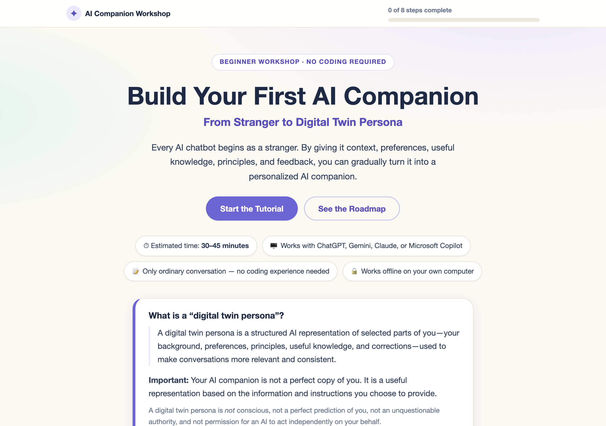
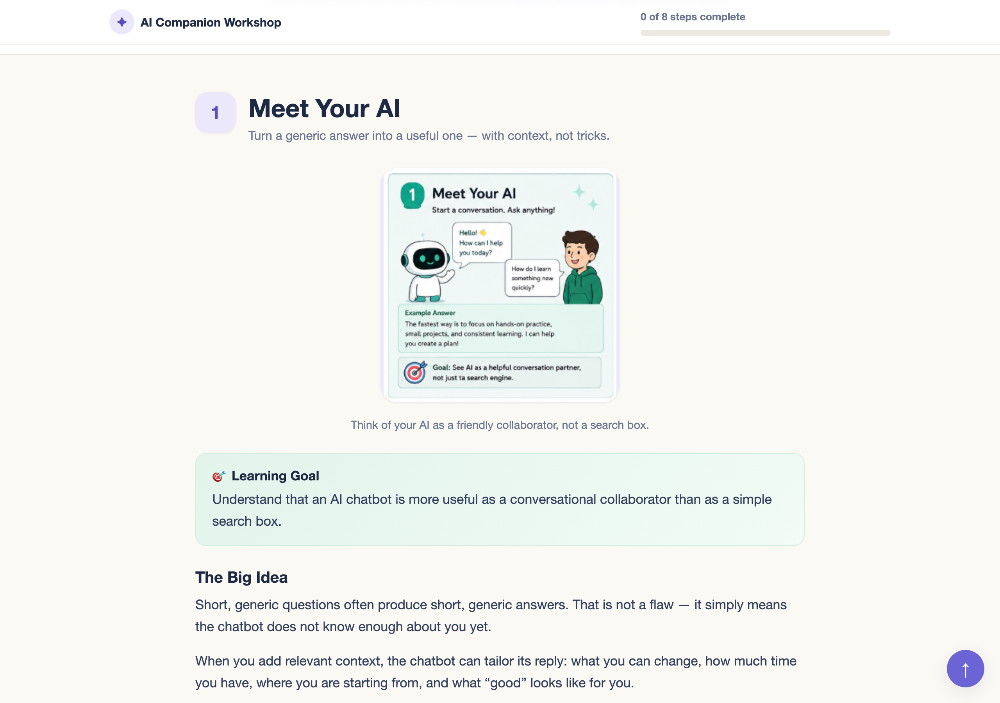
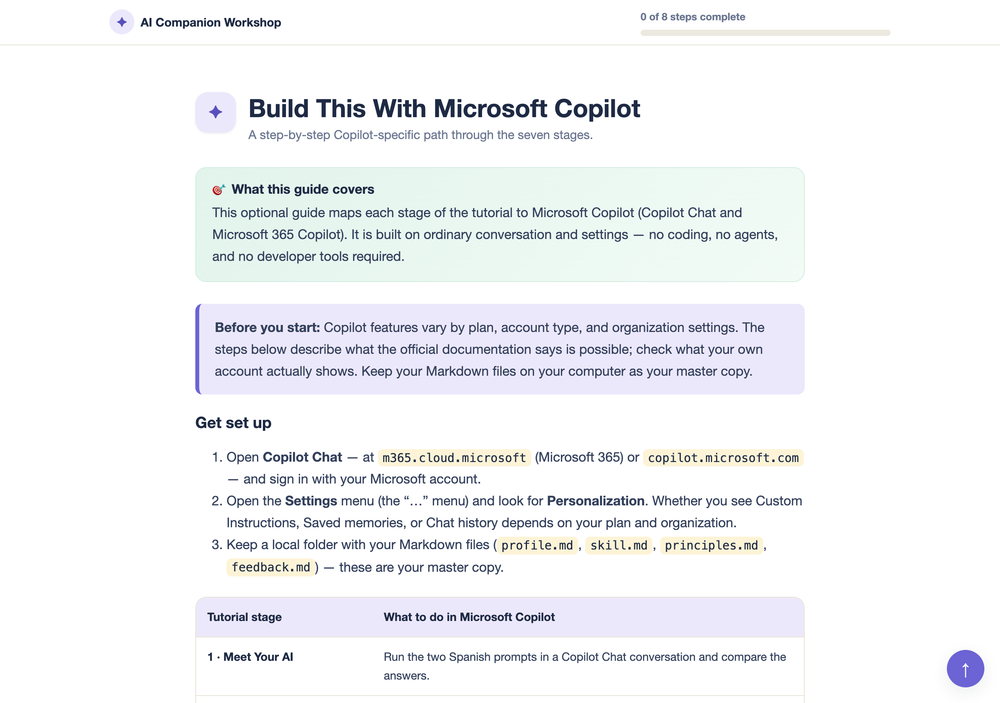
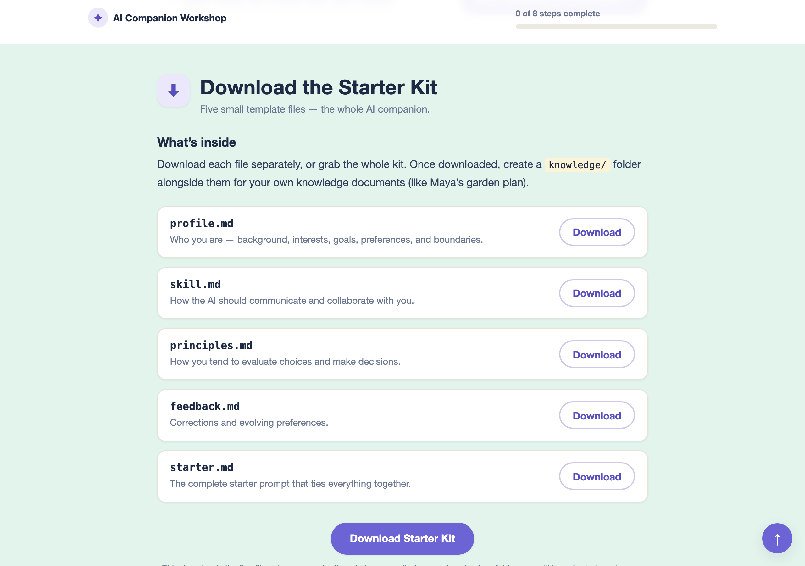

# Build Your First AI Companion

A beginner-friendly, offline, static web tutorial that shows how to turn an
ordinary AI chatbot (ChatGPT, Gemini, Claude, or Microsoft Copilot) into a
personalized **AI companion** using simple Markdown files — no coding required.

[](https://creativecommons.org/licenses/by/4.0/)

> The complete tutorial lives in the [`digital-twin-tutorial/`](digital-twin-tutorial/)
> folder. This README explains what the repository contains and how to get it.

---

## What’s inside

```
DigitalTwin/
├── README.md                    ← this file
├── LICENSE                      ← Creative Commons Attribution 4.0
├── screenshots/                 ← tutorial screenshots (see below)
└── digital-twin-tutorial/       ← the tutorial itself
    ├── index.html               ← the full tutorial page
    ├── styles.css               ← pastel workshop design (responsive, print-friendly)
    ├── script.js                ← copy, progress, downloads, print (no frameworks)
    ├── images/                  ← eight section illustrations
    ├── starter-kit/             ← five template Markdown files
    ├── README.md                ← detailed setup & customization guide
    └── CHANGELOG.md             ← history of changes
```

The tutorial walks you through **seven stages plus a safety checkpoint**:

1. Meet Your AI
2. Introduce Yourself
3. Teach It How You Work
4. Give It Useful Knowledge
5. Grow Together
6. Create Your Digital Twin
7. Keep It Up to Date

It includes a **“Build This With Microsoft Copilot”** guide with an
officially-verified source list, copyable prompts, and a downloadable starter kit
(`profile.md`, `skill.md`, `principles.md`, `feedback.md`, `starter.md`).

---

## Screenshots

The tutorial runs entirely from a single HTML file — no server or internet
connection needed.

### Hero & roadmap


### A lesson stage


### Microsoft Copilot guide


### Download the starter kit


---

## Download the repository as a ZIP

You do not need a GitHub account or any tool to use this tutorial. Two easy ways
to download the whole repository as a ZIP file:

### Option 1 — from the GitHub website

1. Open the repository page:
   **https://github.com/nmatsui7/DigitalTwin**
2. Click the green **Code** button (top-right of the file list).
3. In the dropdown, click **Download ZIP**.
4. A file named `DigitalTwin-main.zip` is downloaded to your computer.

### Option 2 — direct download link

Click or copy this URL into your browser to download the same ZIP without
visiting GitHub:

```
https://github.com/nmatsui7/DigitalTwin/archive/refs/heads/main.zip
```

### Unzip and open

1. Double-click the ZIP to extract it (macOS: `DigitalTwin-main/` appears next
   to the ZIP).
2. Open the extracted folder, then open `digital-twin-tutorial/`.
3. Double-click **`index.html`** — it opens in your default browser.

That’s it. Everything — images, copy buttons, progress tracking, and the
starter-kit downloads — works offline from the local file.

> Tip: keep the folder together (do not move `index.html` out of its folder), so
> the `images/`, `styles.css`, and `starter-kit/` files keep working.

---

## Tech notes

- **Static & private:** no server, no database, no API calls, no CDNs — learner
  data never leaves the browser. Completion progress is stored only in
  `localStorage`.
- **No build step:** edit the text directly in `index.html`; copyable prompts and
  templates are easy to find and change.
- **Accessible:** keyboard-navigable, screen-reader-friendly alt text, and a
  no-JavaScript notice.

See [`digital-twin-tutorial/README.md`](digital-twin-tutorial/README.md) for the
full customization and testing guide.

---

## License

This work is licensed under the
[Creative Commons Attribution 4.0 International License](https://creativecommons.org/licenses/by/4.0/)
(CC BY 4.0).

You are free to **share** and **adapt** the material for any purpose, even
commercially, as long as you give appropriate credit, link to the license, and
indicate if changes were made.

- Full license text: [`LICENSE`](LICENSE)
- Summary of terms (human-readable): <https://creativecommons.org/licenses/by/4.0/>
- Legal code: <https://creativecommons.org/licenses/by/4.0/legalcode>
