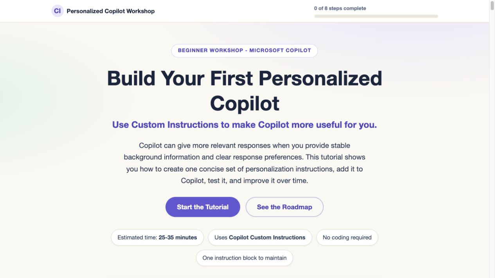
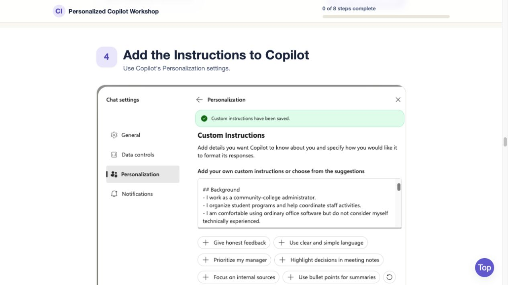
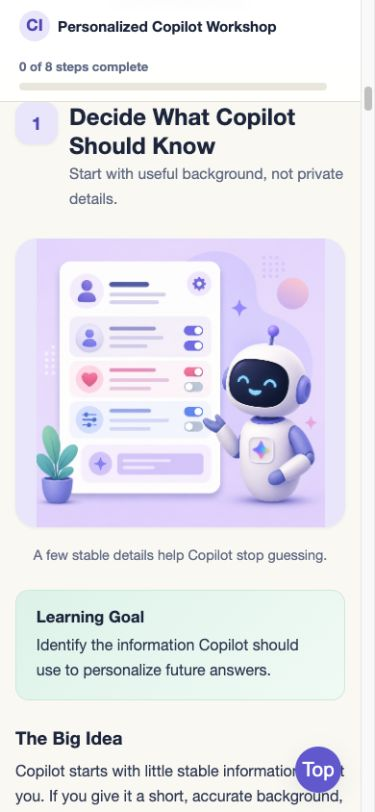

# Build Your First Personalized Copilot

A static, beginner-friendly tutorial for personalizing Microsoft Copilot with the built-in Custom Instructions field.

The workshop teaches nontechnical users how to create one clear set of personalization instructions, add it to Copilot, test the result, and revise it when Copilot needs better guidance. The page is intentionally simple: no accounts are required to view the tutorial, no server-side code runs, and no user input is sent anywhere by this site.

## Screenshots

### Tutorial Start



### Copilot Setup Step



### Mobile Lesson View



## Tutorial Flow

Learners progress through the same workflow they will use in Copilot:

1. Decide what Copilot should know about them.
2. Decide how Copilot should respond.
3. Draft one consolidated Custom Instructions block.
4. Open Copilot Chat settings.
5. Select Personalization.
6. Find Custom Instructions.
7. Paste and save the instructions.
8. Test the result in a new conversation.
9. Revise the saved instructions when necessary.

The tutorial describes a personalized assistant setup: a focused set of Custom Instructions that learners control and update.

## What Is Included

| Path | Purpose |
| --- | --- |
| `index.html` | Main tutorial content and page structure |
| `styles.css` | Responsive visual design |
| `script.js` | Copy buttons, progress tracking, temporary revision notes, and print behavior |
| `images/` | Tutorial illustrations and the Copilot Custom Instructions screenshot |

## Local Preview

You can open `index.html` directly in a browser.

For a local web-server preview, run:

```bash
python3 -m http.server 8000
```

Then open:

```text
http://localhost:8000
```

## Browser Features

The page uses small, dependency-free JavaScript for:

- copying prompts and templates to the clipboard;
- marking lesson sections complete;
- showing progress in the sticky header;
- keeping temporary revision notes for the current browser session;
- expanding examples for printing.

If JavaScript is disabled, the tutorial content is still readable.

## Privacy Notes

This tutorial site does not make API calls and does not send learner content to a server.

Browser storage is limited to:

- completion progress in `localStorage`;
- temporary revision notes in session storage for the current browser session.

The tutorial also reminds learners not to put passwords, authentication details, confidential records, or unnecessary sensitive personal information into Copilot Custom Instructions.

## Validation Checklist

Before publishing changes, verify that:

- all navigation links move to valid sections;
- all referenced image assets load;
- the Copilot Custom Instructions screenshot appears in the setup section;
- copy buttons work;
- progress checkboxes update the progress bar;
- the page has no console errors;
- the layout is readable on desktop and mobile widths;
- old file-management or download workflows have not been reintroduced.

Useful local checks:

```bash
node --check script.js
python3 -m html.parser index.html
```

## Design Notes

The tutorial is written for nontechnical users. Keep future edits:

- direct and instructional;
- centered on Microsoft Copilot Custom Instructions;
- privacy-conscious;
- responsive and accessible;
- free of unnecessary technical setup.
