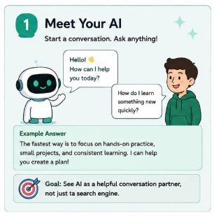

# Build Your First AI Companion

**From Stranger to Digital Twin Persona**

A beginner-friendly, offline, static web tutorial that teaches AI novices how to
personalize an ordinary conversational chatbot (ChatGPT, Gemini, Claude, or
Microsoft Copilot) using simple Markdown files.

This project is a static website. It requires **no server, no database, no build
process, and no internet connection** to run. It makes no API calls and never
sends learner data anywhere.

---

## Contents

| Path | Purpose |
| --- | --- |
| `index.html` | The complete tutorial page |
| `styles.css` | Visual styling (pastel workshop design, responsive, print-friendly) |
| `script.js` | Minimal vanilla JavaScript (copy, progress, downloads, print) |
| `images/` | The eight supplied section illustrations (optimized) |
| `starter-kit/` | The five template Markdown files offered for download |
| `README.md` | This file |
| `CHANGELOG.md` | A history of changes to the project |

---

## 1. Open the tutorial locally

1. Keep the folder together (do not move files out of their subfolders).
2. Double-click `index.html`. It opens in your default browser.
3. That's it. Everything works from the local file — no internet needed.

> If you see a warning in some browsers about "allow file access", it is
> unrelated to this site: the tutorial does not need any special permissions.

---

## 2. Place the eight supplied images in the `images` folder

Put the illustrations in `images/` using these **exact** filenames:

```
images/01-meet-your-ai.png
images/02-introduce-yourself.png
images/03-teach-it-how-you-work.png
images/04-give-it-useful-knowledge.png
images/05-grow-together.png
images/06-create-your-digital-twin.png
images/07-keep-it-up-to-date.png
images/08-stay-safe-and-smart.jpg
```

If the site was downloaded already containing these files, no action is needed.
The safety illustration is supplied as a JPEG to keep it small (the original PNG
was ~1.8 MB; the optimized image is ~190 KB and 800×800 px).

### Rename images if necessary

Your source files may have different names (for example `section1.png`). Rename
them to the filenames above. On macOS you can select each file and press
**Return** to rename, or use a terminal:

```bash
cp /path/to/section1.png images/01-meet-your-ai.png
# ... repeat for each image
```

### Update image paths

Each image is referenced in `index.html`. If you change a filename or move the
folder, update the matching `` tag. For example:

```html

```

The path is relative to `index.html`, so keep the `images/` folder next to it.

---

## 3. Microsoft Copilot guide

`index.html` includes an optional **“Build This With Microsoft Copilot”** section
(linked from the Microsoft Copilot block in the platform comparison) that maps all
seven stages plus the safety checkpoint to Copilot Chat and Microsoft 365 Copilot.

- It covers **Copilot Memory** (saved memories), **Custom Instructions**, **file
  upload** in Copilot Chat, and **Copilot Notebooks** for grounded, persistent answers.
- It intentionally does **not** cover coding agents, Copilot Studio, GitHub Copilot,
  or any developer tooling — the tutorial stays conversational.
- All Microsoft Copilot claims are verified against official Microsoft documentation
  (support.microsoft.com and learn.microsoft.com) with a **“Last verified”** date and
  a full source-link list inside that section. Re-verify before relying on any feature,
  because availability depends on your plan, account type, and organization settings.

---

## 4. Edit tutorial content

All tutorial text lives in `index.html`. Each stage is a `<section class="lesson">`.
To change wording, edit the text inside that section.

- **Copyable prompts and templates** are inside `<pre class="copy-text">` blocks.
- **Example answers** are inside `<details class="answer">` panels.
- **Completion checkboxes** use `data-progress` attributes (e.g. `s1`, `s2`, …).
- **The progress counter** counts every `input[data-progress]` automatically.

If you add or remove a section checkbox, the header progress bar updates itself.

---

## 5. Publish to a static host

Any static host works, e.g. GitHub Pages, Netlify Drop, Cloudflare Pages,
or a simple web server:

```bash
python3 -m http.server 8000
```

Then open `http://localhost:8000` (or upload the folder to your host). No special
configuration is needed.

---

## 6. Test the interactive features

Open `index.html` in a browser and check the following.

### Copy buttons
- Click **Copy** on any prompt or template.
- A small toast confirms "Copied to clipboard."
- Paste somewhere to confirm the exact text was copied.

### Starter-kit downloads
- Click **Download** next to a file in "Download the Starter Kit".
- Check your downloads folder for the `.md` file.
- Click **Download Starter Kit**. In browsers with the File System Access API
  (a secure context), you choose a folder and all five files are saved there,
  plus an empty `knowledge/` folder is created. In other browsers, five
  individual downloads are triggered, and a status message appears under the
  button explaining what to do if the browser blocked any of them.
- The five files also ship in the `starter-kit/` folder, so you can always copy
  them directly — no ZIP file or internet connection is required.

### Completion progress
- Tick any "I completed this section" checkbox.
- The header bar and "X of 8 steps complete" text update.
- Reload the page — your progress is still there (stored in `localStorage`).

### Reset progress
- Click **Reset tutorial progress** in the footer.
- All checkboxes clear and the progress bar returns to zero.
- Your feedback notes (session-only) are not deleted.

### Collapsible example answers
- Open and close an example answer using the triangle summary row.
- They are native `<details>`/`<summary>` elements, so they are keyboard
  accessible: press **Tab** to the summary, then **Enter** or **Space** to toggle.

### Print-friendly mode
- Press **Cmd/Ctrl + P**.
- Interactive controls are hidden, and example answers are expanded
  automatically for printing.

---

## 7. Verify the site works offline

1. Open `index.html` while connected to the internet.
2. Turn on airplane mode or disconnect your network.
3. Reload the page (or just keep browsing).
4. Everything — including images, copy buttons, downloads, and progress —
   keeps working.

The page references only local files and uses no CDNs, fonts, or APIs. The only
external references are the links in the Microsoft Copilot guide, which open
official Microsoft documentation on demand and are not loaded automatically.

### JavaScript off

If JavaScript is disabled, a notice appears at the top. All tutorial content
remains fully readable; the Copy, Download, and progress-tracking buttons simply
need JavaScript. The five starter-kit files are still available in the
`starter-kit/` folder for manual copying.

---

## Privacy note

This website is fully static:

- It does **not** send learner data to a server.
- It does **not** make API calls.
- Completion checkboxes are stored **only in your browser** (`localStorage`).
- The editable feedback notes stay in your browser for the **current session**
  (`sessionStorage`) and are never uploaded; download them if you want to keep them.

---

## Files in the starter kit

```
ai-companion/
├── profile.md
├── skill.md
├── principles.md
├── feedback.md
├── starter.md
└── knowledge/          ← create this folder for your own knowledge files
```

The same five files live in `starter-kit/` so you can copy or edit them directly.

---

## Quality checklist (as implemented)

- All eight images load from `images/` with meaningful `alt` text (verified
  against the actual illustrations; the Section 4 alt text matches the folder
  artwork, and the safety image is served as an optimized JPEG).
- Every prompt and Markdown template has a working copy button.
- Completion checkboxes persist across reloads via `localStorage`.
- Reset-progress clears only progress, not user notes.
- Collapsible example answers are native, keyboard-accessible details elements.
- Starter-kit downloads work offline without a server, with an on-page status
  message and no ZIP dependency (the files also ship in `starter-kit/`).
- A `<noscript>` notice explains what is unavailable when JavaScript is off.
- No medical-information example appears in Section 4.
- The safety illustration (`08-stay-safe-and-smart.jpg`) is used as a standalone
  checkpoint between Sections 3 and 4.
- The digital twin is described as a representation, not a perfect replica.
- Platform-specific claims are general and labeled platform-dependent.
- Microsoft Copilot claims are verified against official Microsoft
  documentation, dated “Last verified: August 1, 2026”, with a source-link list
  in the “Build This With Microsoft Copilot” section.
- No coding-agent, Copilot Studio, or GitHub Copilot content is included.
- Maya’s example consistently uses a small apartment balcony (never a backyard).
- No user-entered personal information is stored automatically in `localStorage`.
